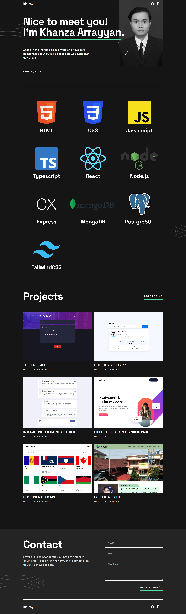

# Frontend Mentor - Single-page developer portfolio solution

This is a solution to the [Single-page developer portfolio challenge on Frontend Mentor](https://www.frontendmentor.io/challenges/singlepage-developer-portfolio-bBVj2ZPi-x). Frontend Mentor challenges help you improve your coding skills by building realistic projects.

## Table of contents

- [Overview](#overview)
  - [The challenge](#the-challenge)
  - [Screenshot](#screenshot)
  - [Links](#links)
- [My process](#my-process)
  - [Built with](#built-with)
  - [What I learned](#what-i-learned)
- [Author](#author)

## Overview

### The challenge

Users should be able to:

- Receive an error message when the `form` is submitted if:
  - Any field is empty
  - The email address is not formatted correctly
- View the optimal layout for the interface depending on their device's screen size
- See hover and focus states for all interactive elements on the page
- **Bonus**: Hook the form up so it sends and stores the user's enquiry (you can use a spreadsheet or Airtable to save the enquiries)
- **Bonus**: Add your own details (image, skills, projects) to replace the ones in the design

### Screenshot



### Links

- Solution URL: [https://github.com/KH-Ray/single-page-developer-portfolio](https://github.com/KH-Ray/single-page-developer-portfolio)
- Live Site URL: [https://khray-portfolio.netlify.app/](https://khray-portfolio.netlify.app/)

## My process

### Built with

- Semantic HTML5 markup
- CSS custom properties
- Flexbox
- CSS Grid
- Mobile-first workflow
- [React](https://reactjs.org/) - JS library
- [TailwindCSS](https://tailwindcss.com/) - A utility-first CSS framework
- [Airtable](https://airtable.com/) - Cloud collaboration service

### What I learned

```svelte
async function createRecord() {
    try {
      const response = await axios.post(
        API_URL,
        {
          fields: {
            ID: uuidv4(),
            Email: email,
            Name: name,
            Message: message,
          },
        },
        {
          headers: {
            Authorization: `Bearer ${AIRTABLE_API_KEY}`,
            "Content-Type": "application/json",
          },
        },
      );

      console.log("Record created successfully:", response.data);
    } catch (error) {
      console.error("Error creating record:", error);
    }
  }

  function handleSubmit() {
    createRecord();

    name = "";
    email = "";
    message = "";
  }

  function handleAnchorClick(event) {
    event.preventDefault();
    const link = event.currentTarget;
    const anchorId = new URL(link.href).hash.replace("#", "");
    const anchor = document.getElementById(anchorId);
    window.scrollTo({
      top: anchor.offsetTop,
      behavior: "smooth",
    });
  }
```

## Author

- Frontend Mentor - [@KH-Ray](https://www.frontendmentor.io/profile/KH-Ray)
